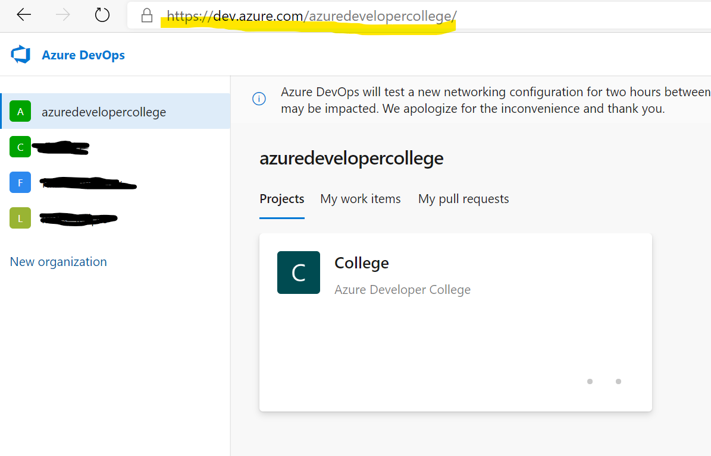
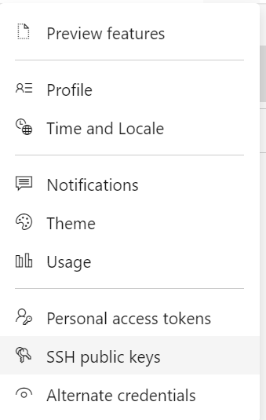
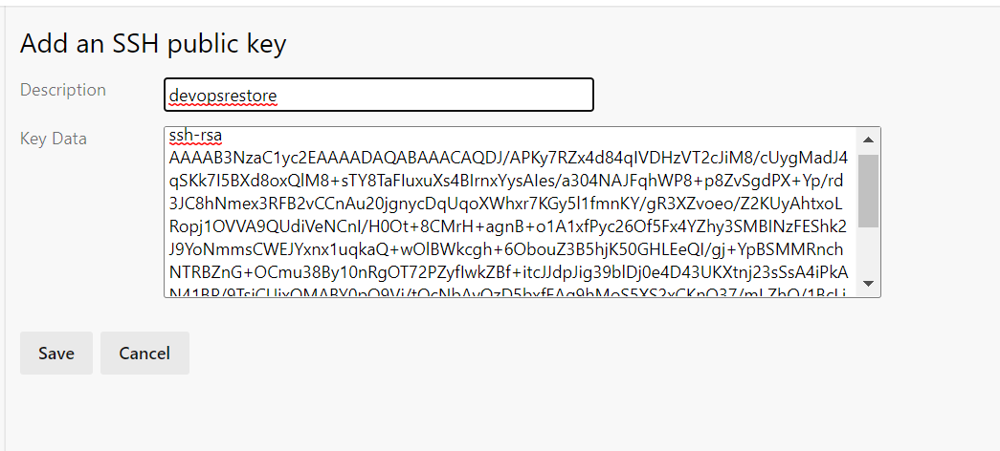
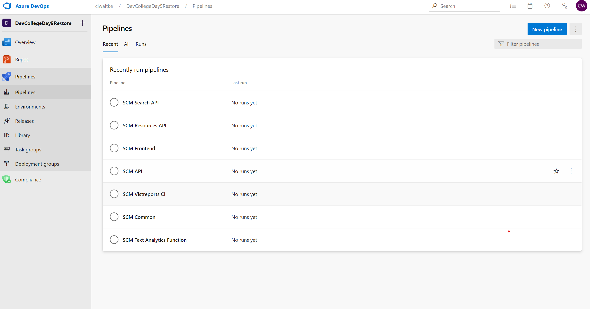
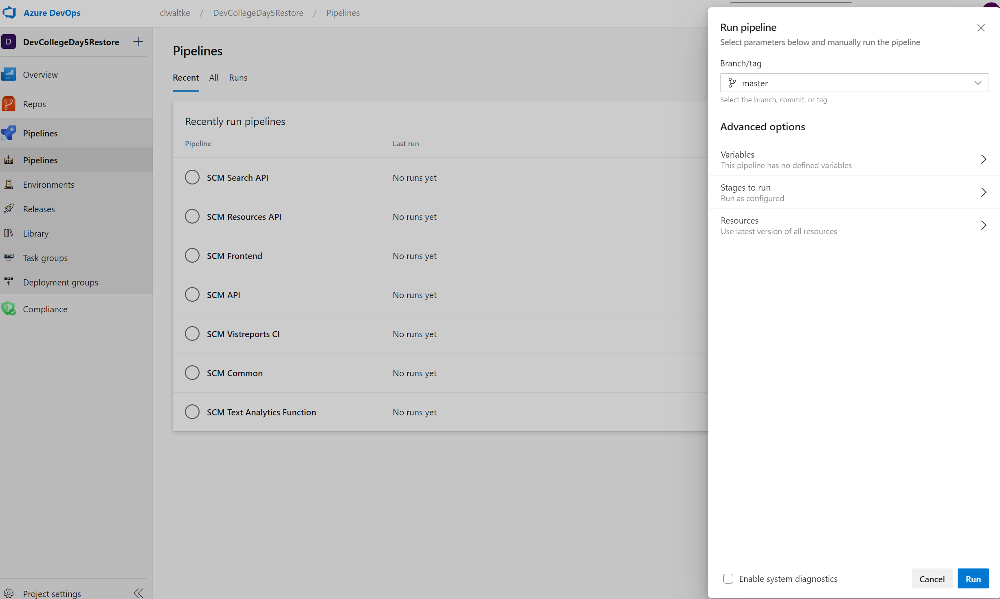
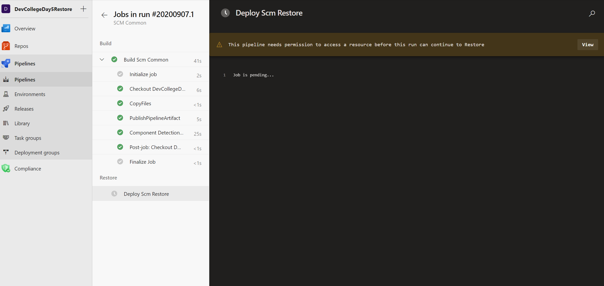
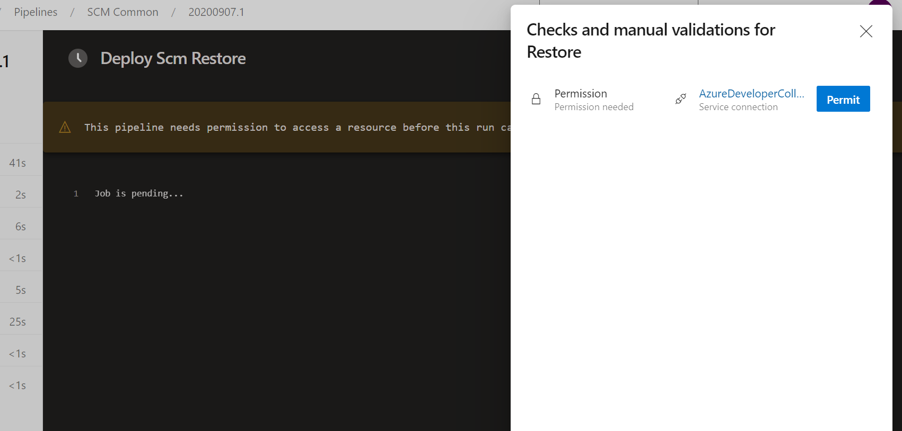
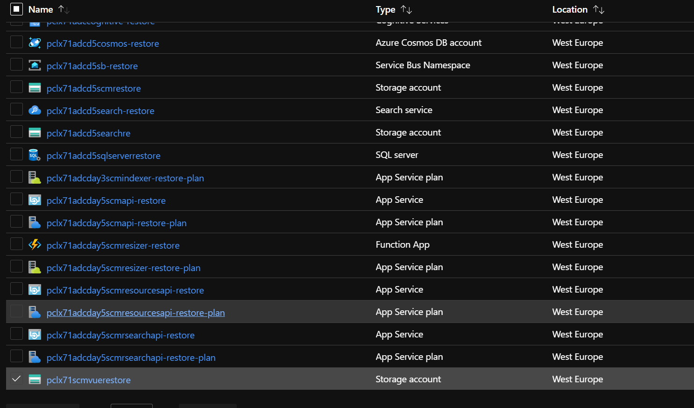
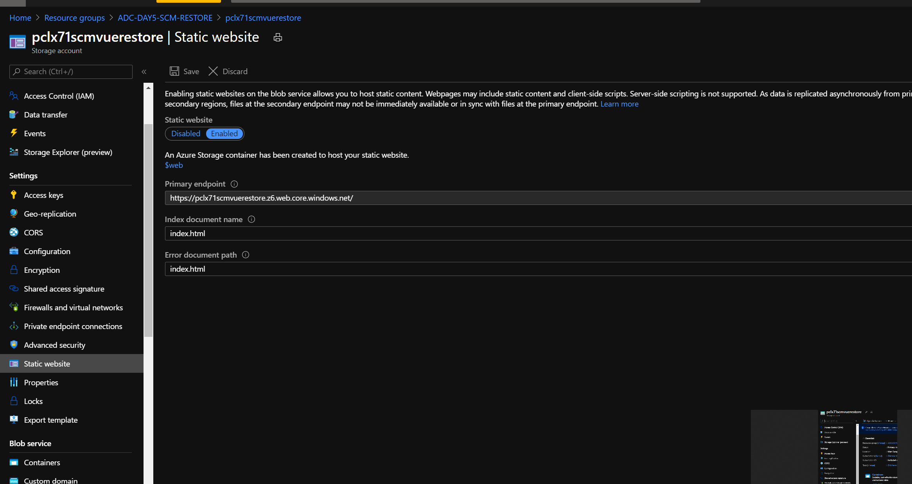

# Pre-day 5 checkpoint

This step by step guide will help you deploy the complete app and DevOps pipelines in a state after completion of day 4.

## Setting up the environment

Clone the official training days repository into you workspace:

```shell
git clone https://github.com/azuredevcollege/trainingdays.git
cd trainingdays/day5/apps/checkpoint/
```

Grab you Azure DevOps organization service url from you browser:



Export the url as environment variable:

```shell
export AZDO_ORG_SERVICE_URL=https://dev.azure.com/<your_organization>
```

Create a personal access token for your Azure DevOps organization.


Create the new token with Admin permissions in you DevOps organization. It needs to be able to create an entire new DevOps Project for you.


Take note of the access token.


Export the personal access token as environment variable:

```shell
export AZDO_PERSONAL_ACCESS_TOKEN=XXXXXXXXXXXXXXXXXXXXXXXXXXXXXXXXXXXXXXXXXXXXXXXXXXXX
```

Login to your azure subscription and make sure the correct subscription is selected:

```shell
az login
az account show
```

Check if you have an ssh key:

```shell
cat ~/.ssh/id_rsa.pub
```

If not generate a new one with the empty password:

```shell
ssh-keygen -b 4096 -C devopsrestore -f ~/.ssh/id_rsa
cat ~/.ssh/id_rsa.pub
```

> To leave the password empty, just hit return twice

Add the public key to you Azure DevOps user





```shell
terraform init
terraform apply
```

Type _yes_ to confirm the terraform action.

Go the the Azure DevOps Website. Your project pipelines should look like this:



Start the _SCM Common_ pipeline first and wait for it to complete.




You will notice that it will stay pending on the deploy job and you will have
to approve the use of the Service Connection for the first time.




After the SCM Common pipeline has successfully deployed you can run the rest
of the pipelines in any order. You will also need to approve access to both
the Azure Container Registry and the Azure Resource Manager.


Once all pipelines have passed you should be able to use the webapp without any errors.

To find you deployed fronted website URL you can navigate to the
_scmvuerestore_ Storage Account in your newly created resource group. You
will find the Primary endpoint listed under static website in the details of
the storage account.




