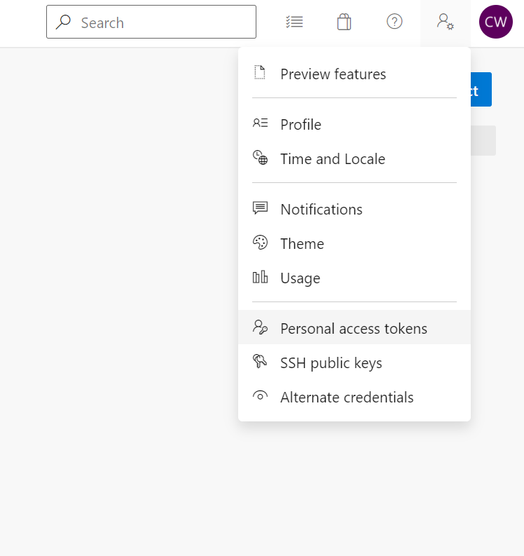
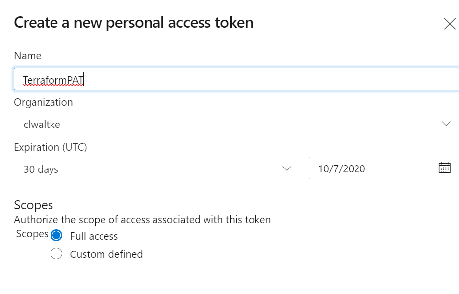
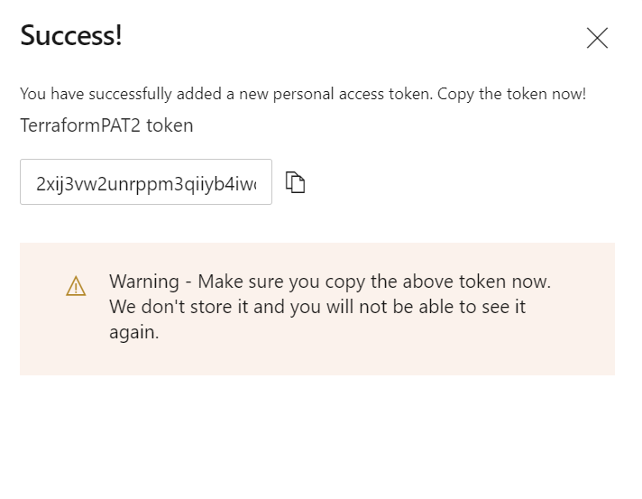
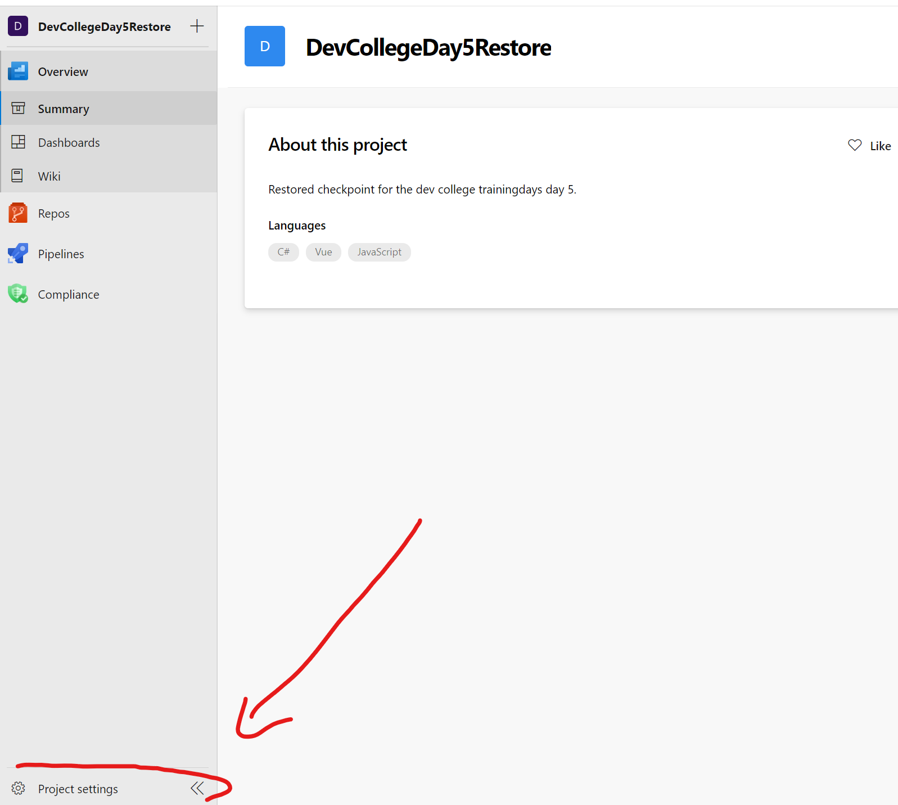
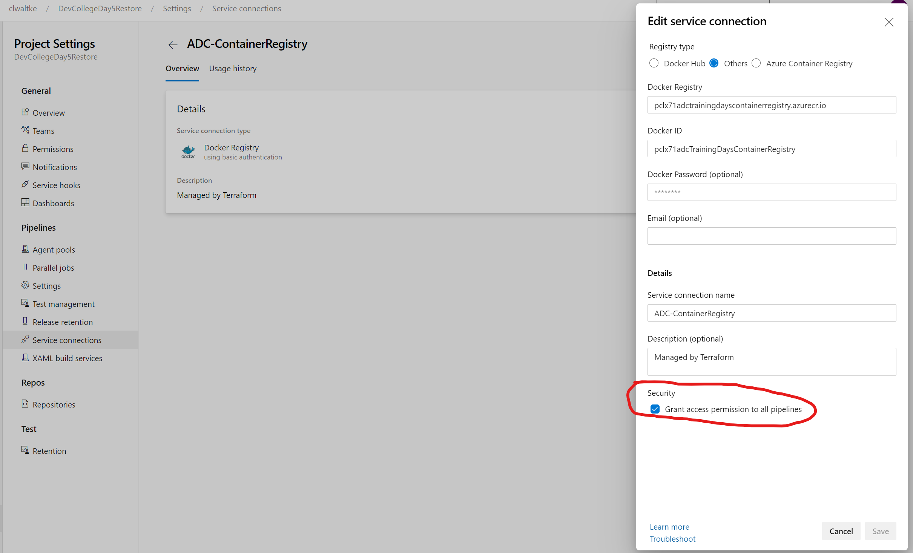
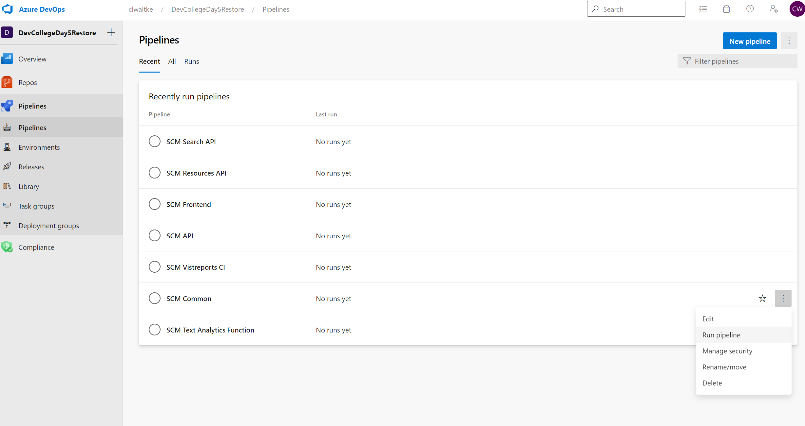
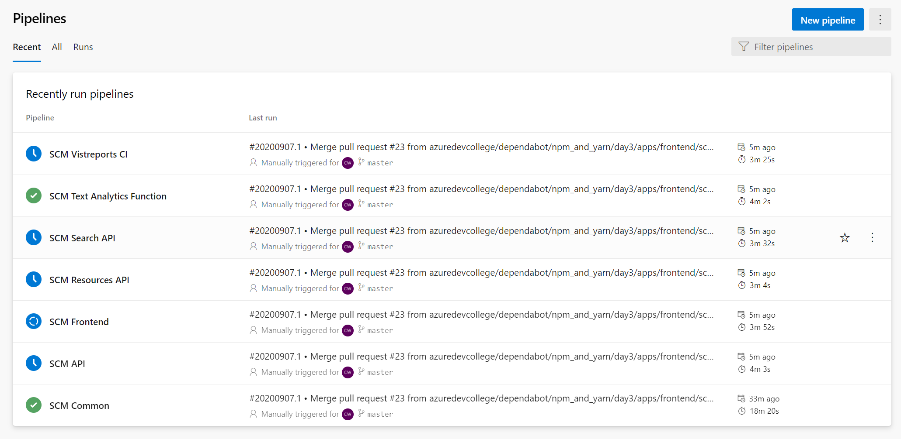
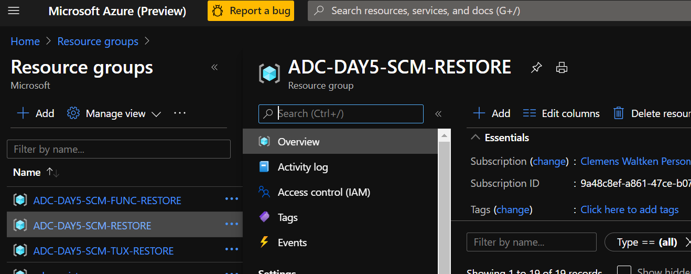

# Pre-day 5 checkpoint

This step by step guide will help you deploy the complete app and DevOps pipelines in a state after completion of day 4.

## Setting up the environment 🔧

To Setup you environment you will need to:

1. Clone the official training days repository
2. Access you Azure DevOps environment to obtain a personal access token (PAT)
3. Login to your Azure CLI
4. Setup SSH-Keys to allow access to your DevOps projects git repositories
5. Export some of the access credentials as environment variables in your shell

Let's get started.

### Clone the training days repository 🐑🐑

To clone the official training days repository into you workspace, open a
Linux Shell (e.g. WSL2 or Azure Cloud Shell) and navigate to your workspace
directory.

Then you can _clone_ the repository using git like this:

```shell
git clone https://github.com/azuredevcollege/trainingdays.git
```

and change into the folder for the day5 restore checkpoint like this:

```shell
cd trainingdays/day5/apps/checkpoint/
```

### Collect access information for Azure DevOps 📃

We will be using terraform with both the Azure Resource Manager and the Azure
DevOps providers. The later requires you to export your Azure DevOps
organizations service URL and a personal access token with administrative
permission in that organization.

First grab you Azure DevOps organization service url from you browser:


and export the url as environment variable:

```shell
export AZDO_ORG_SERVICE_URL=https://dev.azure.com/<your_organization>
```

Now, let's create a personal access token for your Azure DevOps organization.
You can find the option in the top right corner of the Azure DevOps website.



Create the new token with Admin permissions in you DevOps organization, as it
needs to be able to create an entire new DevOps Project for you. Choose a name
you can easily remember to delete after you've finished the course. You
don't want to leave the access credentials lying around.



Hit `create` and take note of the access token after creating the token.



and export the personal access token as environment variable:

```shell
$ export AZDO_PERSONAL_ACCESS_TOKEN=XXXXXXXXXXXXXXXXXXXXXXXXXXXXXXXXXXXXXXXXXXXXXXXXXXXX
```

For terraform to be able to use the Azure Resource Manager APIs in your subscription you need to make sure you're logged into the subscription you want to work with.

```shell
$ az login
```

To check if the correct subscription is selected you can use the `account show` command.

```
$ az account show
```

Should you need to change the subscription, first list the available subscriptions in your account (in table view for better legibility):

```shell
$ az account list -o table
```

then set the desired subscription using it's unique id:

```shell
$ az account set --subscription  xxxxxxxx-xxxx-xxxx-xxxx-xxxxxxxxxxx
```

### Make sure you have a ssh-key ready to use with git 🔑🔐

Let's check if you have an ssh key:

```shell
$ cat ~/.ssh/id_rsa.pub
cat: /home/waltken/.ssh/id_rsa.pub: No such file or directory
```

This would mean that you do not have an existing key around, so let's generate a new one.
We'll create a new 4096 **b**it key with the **C**omment `devopsrestore` at the default location for ssh keys. A **f**ile named `id_rsa` in you home-folders `.ssh` directory.

```shell
$ ssh-keygen -b 4096 -C devopsrestore -f ~/.ssh/id_rsa
```

> To leave the password empty, just hit return twice

Now let's grab the corresponding public key:

```
$ cat ~/.ssh/id_rsa.pub
ssh-rsa AAAAB3NzaC1yc2EAAA...
...
... devopsrestore
```

You'll need to copy multiple lines from `ssh-rsa` until `devopsrestore`, the entire public key of of you ssh-key.

Now wee need to register the public key to your Azure DevOps user. This allows Azure DevOps to validate you identity without prompting for a password.

From the top right menu we used earlier, now select the `SSH public keys` menu item.


You should see a list with you already registered public keys. Don't worry if it's empty. We will now add you first key to the list, by hitting the `Add` button


Now paste you public key into the `Key Data` section and give it a name to your liking.


> Should you have an existing key with a passphrase you will have to unlock the key for
> the `terraform apply` step about to follow:
>
> ```shell
> $ eval $(ssh-agent -s) # start the ssh-agent
> $ ssh-add ~/.ssh/id_rsa # unlock your key for use in this session
> ```

### Use terraform to setup the DevOps project 🌏

Let's make sure you have terraform version v0.13.2 or higher.

```shell
$ terraform version
Terraform v0.13.2
```

Please update your terraform version, should this not be the case.

Now let's initialize terraform and download the required modules and providers:

```shell
$ terraform init
```

We are ready to apply the prepared infrastructure as code (IaC) to you Azure Subscription and Azure DevOps Account.

```shell
$ terraform apply
```

Make sure that the generated plan only shows new resources to create and then
type _yes_ to confirm the terraform action.

Make sure the process runs through without any errors.

Congratulations! You are done with the terminal (for now ;-).

## Run the pipelines 🏃‍♀️‍

The last part will be to run the pre-configured pipelines and find the url of
the deployed website.

Let's go the the Azure DevOps Website. Your project pipelines should look like this:


Before we run any pipeline let's authorize all pipelines to use the
configured Service Connections. In the lower left corner select `Project settings` and navigate to `Service Connections`.



You should see to Service Connections configured for you project. Select the
edit option for each of them and make sure the checkbox for _Grant access
permission to all pipelines_ is ticked.



Start the _SCM Common_ pipeline first and wait for it to complete. The common
pipeline creates the Azure Resource Group and some share resources that the
other project pipelines depend upon. This will take about 13 minutes to deploy. So let's take a short break, we are almost done.




> If you notice that it stays pending you need to make sure your Service
> Connections grant access to all pipelines first.


After the SCM Common pipeline has successfully deployed you can run the rest



Once all pipelines have passed you should be able to use the webapp without
any errors.

### Discover the website 🔍📃

To find your deployed fronted website URL, you can navigate to the
_scmvuerestore_ Storage Account in your newly created resource group. You
will find the _Primary endpoint_ listed under static website in the details of
the storage account.




Hooray! 🥳🎈🎉 You've successfully restore to the pre-day5 checkpoint and are ready to go ahead an learn everything about Active Directory integration!
